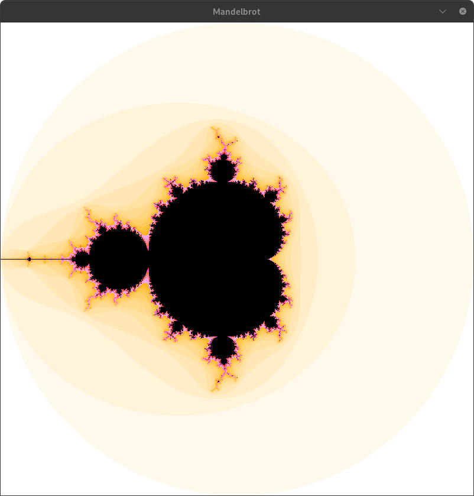
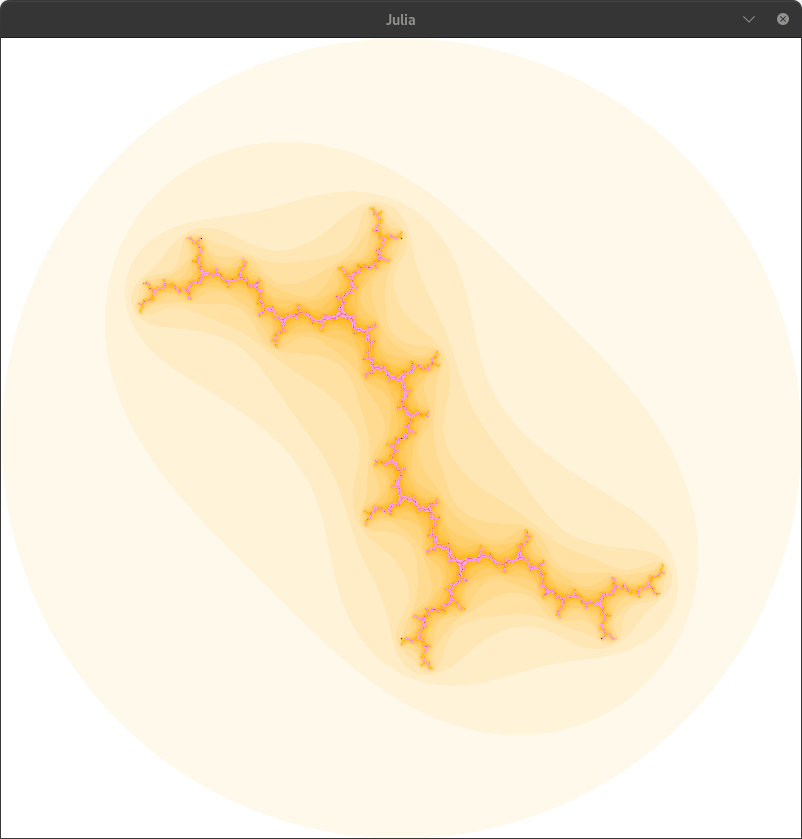
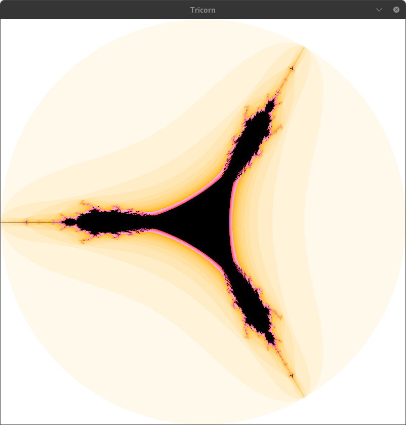

<div align="center">

# Frac2L 

**An interactive, high-performance fractal visualizer crafted in C with MiniLibX.**  
*Developed as part of the 42 Network curriculum (fract-ol project).*

[](https://42.fr/)
[](https://en.wikipedia.org/wiki/C_(programming_language))
[](https://github.com/42Paris/minilibx-linux)
[](https://github.com/42School/norminette)
[](https://www.kernel.org/)

</div>

---

## Visual Showcase

<div align="center">

| **Mandelbrot Set** | **Julia Set** `(0.0, -1.0)` | **Tricorn (Mandelbar)** |
|:------------------:|:---------------------------:|:-----------------------:|
|  |  |  |
| *Classic cardioid & bulbs* | *Connected dendrite filament* | *Tri-fold symmetric conjugate* |

</div>

---

## Overview

In mathematics, a **fractal** is a geometric shape containing complex, self-similar structure at arbitrarily small scales. No matter how much you magnify a fractal boundary, you uncover infinite layers of intricate, repeating patterns.

**Frac2L** is an optimized graphical rendering engine capable of exploring the complex plane in real time. It implements:
- Smooth zoom tracking centered around navigation vectors.
- Fine-grained pan navigation across the real and imaginary axes.
- Dynamic iteration tuning to balance rendering speed and boundary precision.
- Escape-time continuous color gradients.

---

## Mathematical Foundations

All fractals in this engine are simulated on the **Complex Plane** $\mathbb{C}$, where any point $z \in \mathbb{C}$ is represented as:

$$z = x + i y \quad (x, y \in \mathbb{R},\; i^2 = -1)$$

### 1. The Mandelbrot Set

The Mandelbrot set is defined by the quadratic recurrence equation:

$$z_{0} = 0$$
$$z_{n+1} = z_{n}^2 + c$$

Where $c = x + iy$ corresponds to the complex coordinate of the current pixel.  
If the sequence $|z_n|$ does not diverge to infinity ($|z_n| \le 2$ for all $n$), then $c$ belongs to the set. In the engine, divergence is proven as soon as:

$$\text{Re}(z)^2 + \text{Im}(z)^2 > 4.0$$

### 2. The Julia Set

While the Mandelbrot set iterates over varying $c$ values with $z_0 = 0$, a **Julia set** fixes $c \in \mathbb{C}$ as a constant parameter and sets the initial value $z_0$ to the pixel's coordinate:

$$z_{0} = x_{\text{pixel}} + i y_{\text{pixel}}$$
$$z_{n+1} = z_{n}^2 + c$$

Depending on the chosen constant $c = c_r + i c_i$, the resulting Julia set can take the form of completely connected structures or disconnected "Cantor dust".

### 3. The Tricorn (Mandelbar) Set

The Tricorn (also called the *Mandelbar set*) is an antiholomorphic fractal generated by applying the **complex conjugate** $\bar{z} = x - i y$ at each step:

$$z_{0} = 0$$
$$z_{n+1} = (\bar{z}_{n})^2 + c$$

Expanding the conjugate iteration:

$$\text{Re}(z_{n+1}) = \text{Re}(z_n)^2 - \text{Im}(z_n)^2 + \text{Re}(c)$$
$$\text{Im}(z_{n+1}) = -2 \cdot \text{Re}(z_n) \cdot \text{Im}(z_n) + \text{Im}(c)$$

This alteration breaks standard holomorphic Cauchy-Riemann symmetries and produces a characteristic **three-cornered (tri-fold)** structure.

### 4. Escape-Time Algorithm & Color Mapping

Pixels that remain bounded after `iteration` steps are colored pitch black (`0x000000`), signifying interior membership. Pixels that escape at step $k < \text{iteration}$ are mapped across a vibrant color gradient using linear interpolation:

$$\text{Color}(k) = \text{map}(k, \text{0xFFFFFF}, \text{0xFF00FF}, \text{iteration})$$

---

## Project Architecture

The codebase has been refactored into a clean, modular structure following the standard conventions of high-grade C projects:

```
Frac2L/
├── Makefile                # Build automation with color-coded feedback
├── README.md               # Complete project documentation and guide
├── includes/
│   └── fractol.h           # Data structures, prototypes, and keycode macros
├── src/
│   ├── main.c              # CLI validation, help display, and orchestrator
│   ├── init.c              # MiniLibX connection, window setup, and event hooks
│   ├── render.c            # Pixel loop and color interpolation
│   ├── fractals.c          # Mathematical formulas (Mandelbrot, Julia, Tricorn)
│   ├── events.c            # Keyboard pan/zoom/iterations and mouse handlers
│   ├── math_utils.c        # Linear coordinate mapping (map function)
│   ├── atof.c              # Custom float/double string parser
│   └── utils.c             # String utilities, safe memory cleanup, usage guide
└── images/
    ├── Mandelbrot.png      # Mandelbrot render capture
    ├── Julia.png           # Julia render capture
    └── Tricorn.png         # Tricorn render capture
```

### Module Responsibilities

| Module | Source File | Purpose |
|:---|:---|:---|
| **Entry & CLI** | [`src/main.c`](src/main.c) | Parses CLI arguments, checks validity, triggers usage guide on error |
| **Window & MLX** | [`src/init.c`](src/init.c) | Initializes connection to X server, creates window and image buffer |
| **Renderer** | [`src/render.c`](src/render.c) | Maps window coordinates to complex plane and pushes frame to screen |
| **Mathematics** | [`src/fractals.c`](src/fractals.c) | Core iteration algorithms for Mandelbrot, Julia, and Tricorn |
| **Interactivity** | [`src/events.c`](src/events.c) | Listens for keyboard navigation and mouse scroll events |
| **Mapping** | [`src/math_utils.c`](src/math_utils.c) | Screen-to-complex range normalizer (`map`) |
| **String Parser** | [`src/atof.c`](src/atof.c) | Converts user input strings to IEEE-754 double precision floats |
| **Diagnostics** | [`src/utils.c`](src/utils.c) | Comprehensive error messaging and leak-free memory cleanup |

---

## Controls & Navigation

| Control | Action | Details |
|:---|:---|:---|
| <kbd>Mouse Wheel Up</kbd> | **Zoom In** | Focuses magnification inward ($15\%$ per step) |
| <kbd>Mouse Wheel Down</kbd> | **Zoom Out** | Widens field of view ($15\%$ per step) |
| <kbd>↑</kbd> <kbd>↓</kbd> <kbd>←</kbd> <kbd>→</kbd> | **Pan / Move** | Shifts viewing window across the complex plane |
| <kbd>+</kbd> / <kbd>Keypad +</kbd> | **Increase Iterations** | Enhances boundary sharpness and detail |
| <kbd>-</kbd> / <kbd>Keypad -</kbd> | **Decrease Iterations** | Speeds up rendering by lowering calculation limit |
| <kbd>ESC</kbd> or <kbd>Window (X)</kbd> | **Exit Program** | Safely frees all allocations and exits cleanly |

---

## Recommended Julia Coordinates

The Julia set produces wildly different topological structures depending on the coordinates of $c$. Try these fascinating coordinates:

| Preset Name | Real ($c_r$) | Imag ($c_i$) | Command to Run |
|:---|:---:|:---:|:---|
| **Classic Connected** | `0.0` | `-1.0` | `./fractol Julia 0.0 -1.0` |
| **Douady's Rabbit** | `-0.123` | `0.745` | `./fractol Julia -0.123 0.745` |
| **Dendrite Crystal** | `0.0` | `1.0` | `./fractol Julia 0.0 1.0` |
| **San Marco Dragon** | `-0.75` | `0.1` | `./fractol Julia -0.75 0.1` |
| **Siegel Disk** | `-0.391` | `-0.587` | `./fractol Julia -0.391 -0.587` |
| **Spiral Galaxy** | `-0.7` | `0.27015` | `./fractol Julia -0.7 0.27015` |
| **Starfish Filament**| `-0.8` | `0.156` | `./fractol Julia -0.8 0.156` |

---

## Getting Started

### Prerequisites

#### On Linux (Ubuntu / Debian / 42 Workstations):
```bash
sudo apt-get update
sudo apt-get install -y gcc clang make xorg libxext-dev libbsd-dev
```
Ensure `minilibx-linux` is installed in your system library path or linked accordingly.

#### On macOS:
Install XQuartz (or use the native Cocoa MiniLibX distribution):
```bash
brew install xquartz
```

### Installation & Build

1. Clone the repository:
```bash
git clone https://github.com/ahmedez-zouine/Frac2L.git
cd Frac2L
```

2. Compile using `make`:
```bash
make
```
*The build system creates an `obj/` directory and compiles with `-Wall -Wextra -Werror`.*

### Usage Examples

```bash
# Explore the Mandelbrot set
./fractol Mandelbrot

# Explore the Tricorn (Mandelbar) fractal
./fractol Tricorn

# Explore a custom Julia set (real, imaginary)
./fractol Julia -0.4 0.6
```

If an incorrect argument is passed, Frac2L provides a complete usage menu directly in your terminal:
```text
╔═══════════════════════════════════════════════╗
║               Frac2L - Usage Guide            ║
╚═══════════════════════════════════════════════╝

Available Fractals:
  1. Mandelbrot
  2. Tricorn
  3. Julia <real> <imag>
...
```

---

## Code Quality & Norm Compliance

- **42 Norminette**: All source files adhere strictly to the 42 School coding standard (function lengths $\le 25$ lines, max 4 parameters, max 5 functions per file, explicit variable declaration).
- **Memory Safety**: No memory leaks. All allocated textures, image buffers, window pointers, and MLX display contexts are deallocated upon window close or ESC interrupt.
- **Robust Input Parsing**: Handles negative values, decimals, multiple symbols, and trailing whitespaces gracefully through custom validation routines.

---

## Author & Credits

Designed and maintained by **Ahmed Ez-Zouine** (`aez-zoui`):
- **GitHub**: [@ahmedez-zouine](https://github.com/ahmedez-zouine)
<!-- - **School**: 1337 Coding School / 42 Network -->

---

## License

This project is licensed under the [MIT License](LICENSE).

---

<div align="center">
  <sub>If you enjoyed exploring the infinite beauty of fractals with Frac2L, consider starring the repo!</sub>
</div>
